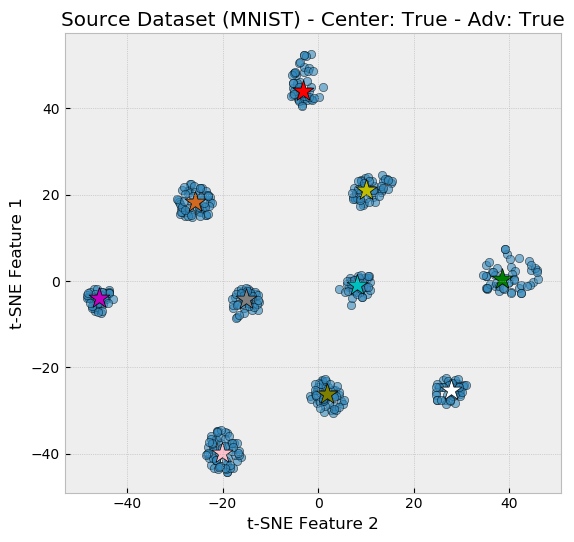
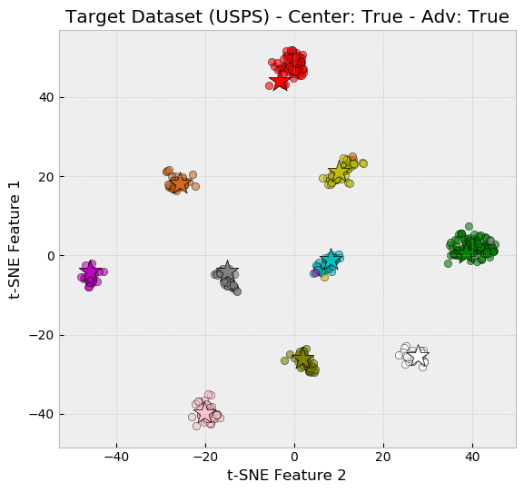

# M-ADDA: Metric-based Adversarial Discriminative Domain Adaptation [[Paper]](https://arxiv.org/abs/1807.02552)
Accepted in the ICML 2018 Workshop of Domain Adaptation for Visual Understanding (DAVU).

## Description

The idea is to cluster the source dataset using the triplet loss and then cluster the target dataset using adversarial learning and the center-magnet loss. The Figure below shows the resultant clusters after using this method. The different colored stars represent the cluster centers, each corresponding to a different digit category.

Source (MNIST)            |  Target (USPS)
:-------------------------:|:-------------------------:
  |  

## Requirements

- pytorch 0.4.0.
- torchvision 0.2.0

## Download the datasets

```
cd datasets
bash download.sh
```

## Test results

To obtain the test results, do the following two steps:

### 1. Download the checkpoints

```
cd checkpoints
bash download.sh
```

### 2. Run the following command,

```
python main.py -e usps2mnist mnist2usps uspsBig2mnistBig mnistBig2uspsBig -m test_model
```

The output should be,

```
mnist2usps          0.955676
mnistBig2uspsBig    0.980541
usps2mnist          0.951500
uspsBig2mnistBig    0.983100
```
which represent the accuracies obtained on the target test set.

- mnistBig, and uspsBig use the full training set.
- mnist, and usps use 2000 images from MNIST and 1800 images from USPS for training, respectively.

## Training the models

### 0. Download the pretrained models and the usps dataset

```
cd checkpoints
bash download.sh
cd ..
cd datasets
bash download.sh
cd ..
```

### 1. Experiment USPS => MNIST


```
python main.py -e usps2mnist  -m train -rt 1
```

### 2. Experiment MNIST => USPS


```
python main.py -e mnist2usps  -m train -rt 1
```

### 3. Experiment MNIST ALL => USPS ALL


```
python main.py -e mnistBig2uspsBig  -m train -rt 1
```

### 4. Experiment USPS ALL => MNIST ALL


```
python main.py -e uspsBig2mnistBig  -m train -rt 1
```


## Citation 
If you find this useful for your research, please cite:

```bibtex
@Article{laradji2018m,
    title={M-ADDA: Unsupervised Domain Adaptation with Deep Metric Learning},
    author={Laradji, Issam and Babanezhad, Reza},
    journal={arXiv preprint arXiv:1807.02552},
    year = {2018}
}
```
